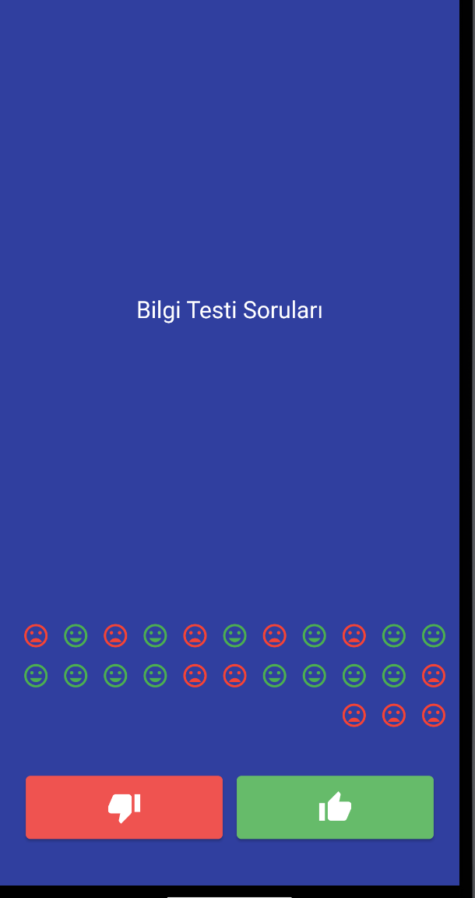

# bilgitesti

Verilen bilgi soruların doğrularını bulma testidir. Verilen cevaba göre olumlu veya olumsuz emoji ifadeleri çıkacaktır böylelikle yanlış veya doğgru doğru yapıldı ortaya çıkacaktır.
 

